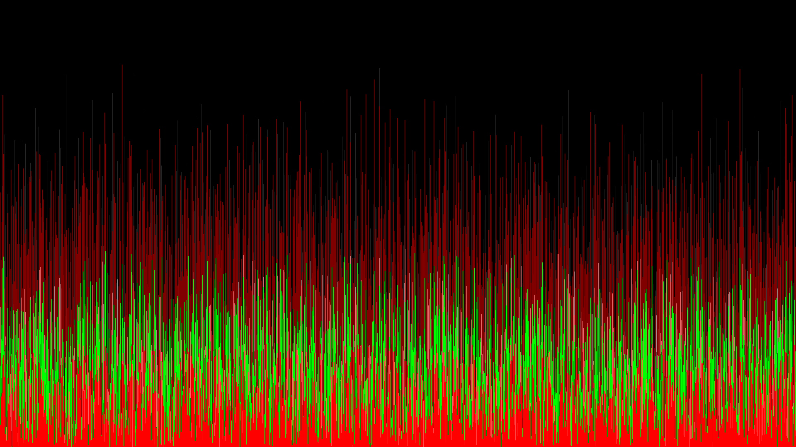

Take an input filename with 1920 lines (which is the width of the image in pixels) where each line has for example R:300,G:200 which would represent the first  vertical line having 300 pixels of red followed by another 200 pixels of green above it.

After all 1920 lines are processed the image can be rendered to stdout and converted to png. You need to have the Image Magick utilities installed.

The example input_multibarchart.txt will just draw 3 bars at the left side of the picture.

You can generate a more complete input file by running ./gen_multibarchart

